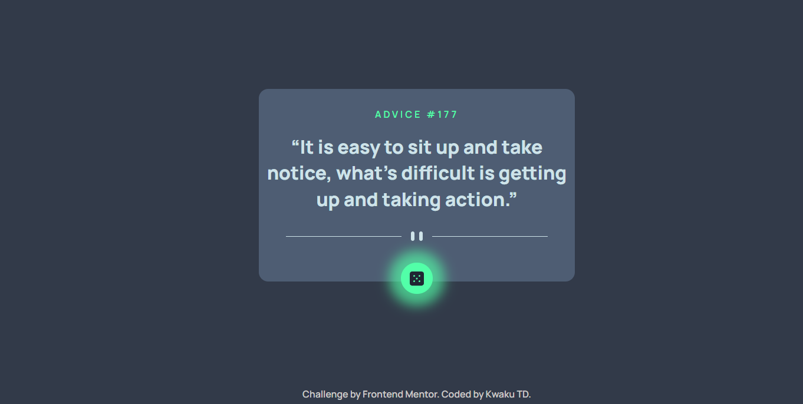

# Frontend Mentor - QR code component solution

This is a solution to the [Advice Generator App challenge by Frontend Mentor](https://www.frontendmentor.io/challenges/qr-code-component-iux_sIO_H). Frontend Mentor challenges help you improve your coding skills by building realistic projects.

## Table of contents

- [Overview](#overview)
  - [Screenshot](#screenshot)
  - [Links](#links)
- [My process](#my-process)
  - [Built with](#built-with)
  - [What I learned](#what-i-learned)
  - [Continued development](#continued-development)
  - [Useful resources](#useful-resources)
- [Author](#author)
- [Acknowledgments](#acknowledgments)

## Overview

This is a beginner friendly project from Frontend Mentor.

### Screenshot

### Links

- Solution URL: [📂](https://github.com/syntaCorp/advice-generator-app)
- Live Site URL: [🌐](https://syntacorp.github.io/advice-generator-app//)

### Built with

- Semantic HTML5 markup
- Vanilla JavaScript
- CSS custom properties
- Flexbox
- Mobile-first workflow

### What I learned

This project exposed me to Fetch API, and Async-await 

1.  Fetch API (GET / POST requests )
2.  Event Listeners

## Author

- Website - Kwaku TD. (https://github.com/syntaCorp)
- Frontend Mentor - [@cyberstrong](https://www.frontendmentor.io/profile/syntaCorp)

### Useful resources

- [MDN](https://developer.mozilla.org/en-US/docs/Web/API/Fetch_API/Using_Fetch) - This was a good reference for fetch API syntax.
